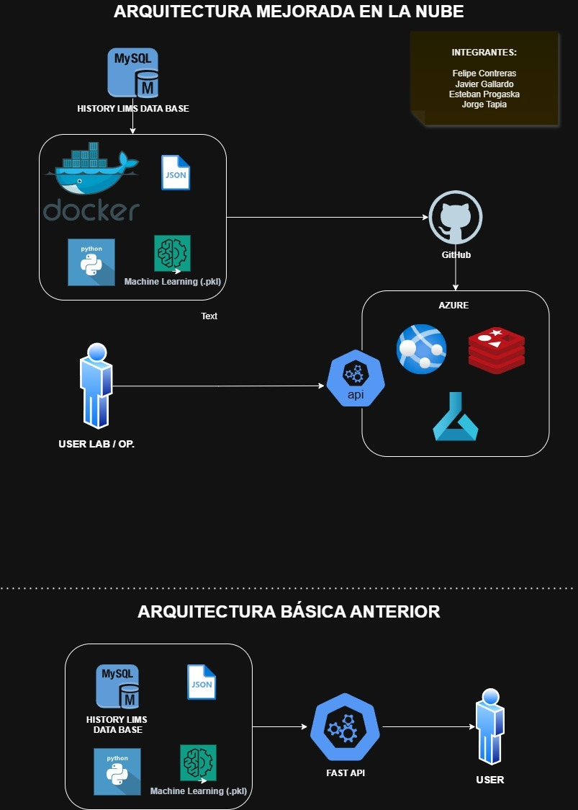

# Estimación de Octanaje con MLOPS

## Descripción del proyecto

UAI Ramo de MLOPs. 

- Estimación de octanaje.
- ENAP Produce dos tipos de gasolinas, la gasolina de 93 octanos en sus versiones región metropolitana y regiones, la misma condición se da para el producto de gasolina 97 octanos. 

- El problema de negocio a resolver es que ambos productos se producen En promedio con una sobre especificación de 0.8 octanos. 

- La idea de este trabajo es llevar un modelo de estimación de machine learning, desde un ambiente de desarrollo hasta un ambiente productivo.

- Para desarrollar esta migración se realizaron varias pruebas de verificación del modelo en cuanto a su poder de estimación, tanto en la fase de desarrollo, como en la fase de despliegue en la aplicación FLY.IO

## API ENTOR WEB
Para visualizar la documentación de la api [click aquí](https://api-nor-test2.fly.dev/docs)

## Esquema general del proyecto

## API ENTORNO LOCAL

 

## Variables Pedictoras

Para testear correctamente la api, se recomiendan los siguientes parametros:

- API Gravedad, Digital 60°F	60.2
- Densidad, Digital 15°C	737.8
- PIE Evaporado	32.2
- 10% Evaporado	50.2
- 30% Evaporado	64.2
- 50% Evaporado	82.7
- 70% Evaporado	115.9
- 90% Evaporado	157.4
- 95% Evaporado	174.1
- Punto Final	197.4
- TOTAL	100.0
- Azufre	15.0
- Presión de vapor	9.01
- Aromáticos	23.7
- Benceno	0.79
- Olefinas	14.9
- MTBE %m	9.6013
- MTBE	9.50
- Oxígeno total.	1.74

